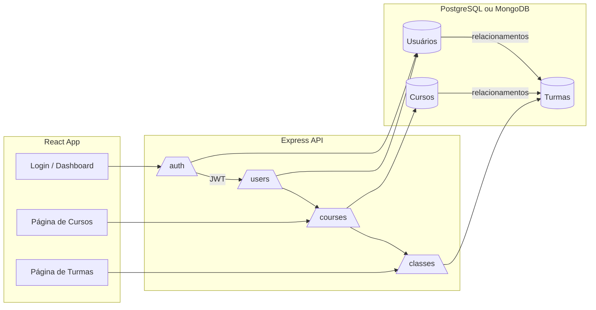

# Arquitetura do Sistema

```mermaid
flowchart LR
  subgraph Frontend [React App]
    A[Login / Dashboard]
    B[Página de Cursos]
    C[Página de Turmas]
  end

  subgraph Backend [Express API]
    D[/auth\] -->|JWT| E[/users\]
    E --> F[/courses\]
    F --> G[/classes\]
  end

  subgraph Database [PostgreSQL ou MongoDB]
    H[(Usuários)]
    I[(Cursos)]
    J[(Turmas)]
  end

  A --> D
  B --> F
  C --> G
  D --> H
  E --> H
  F --> I
  G --> J
  H -- relacionamentos --> J
  I -- relacionamentos --> J
```
